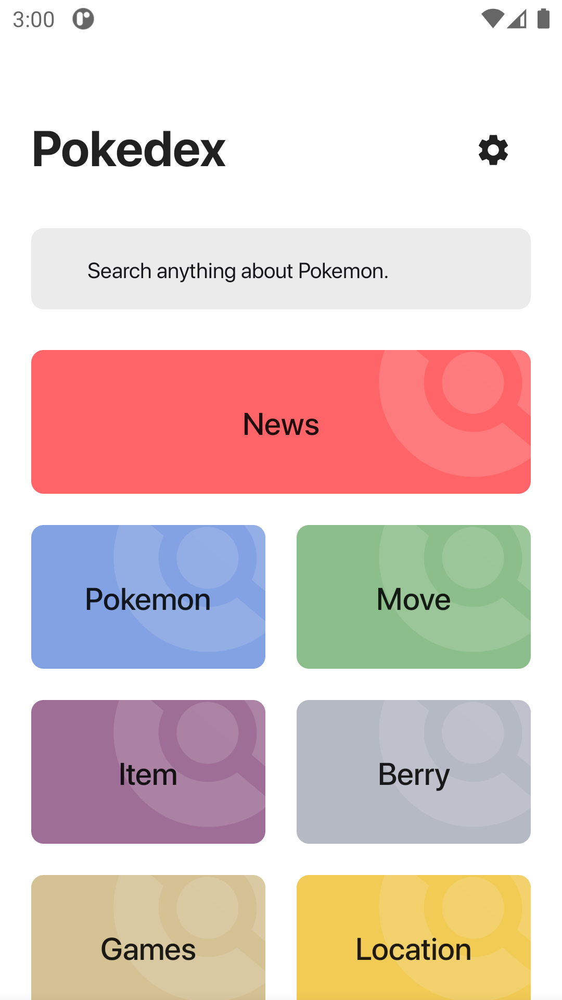
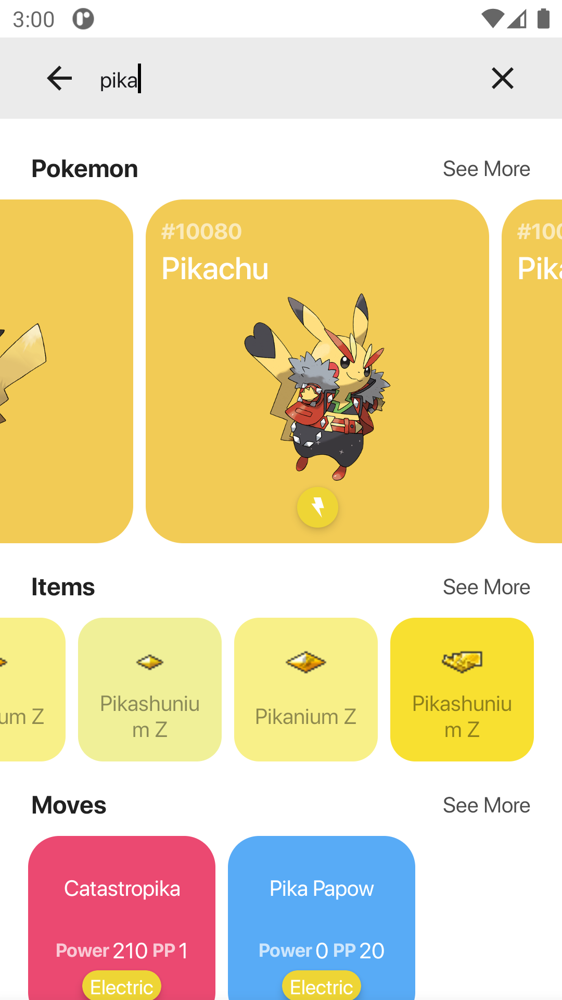
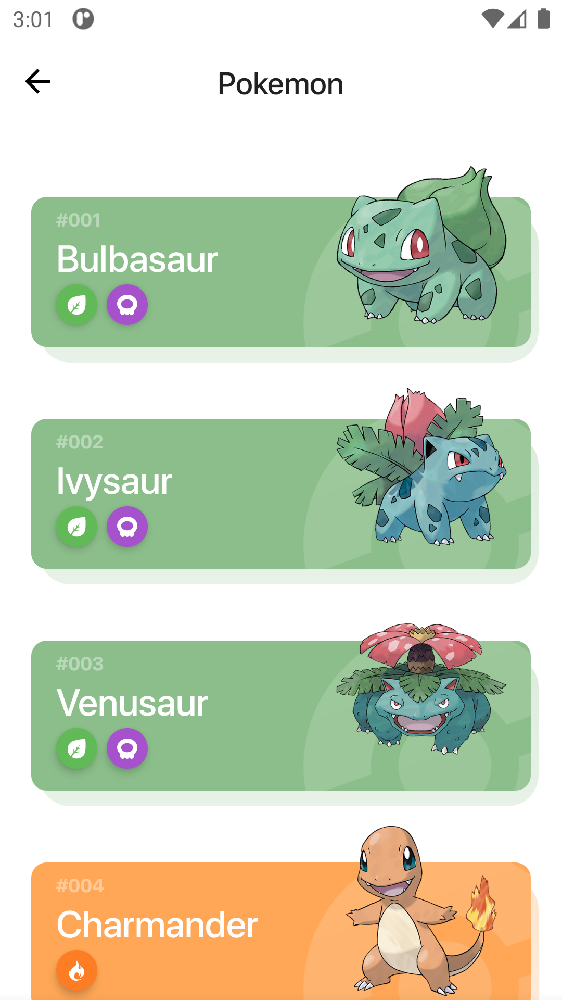
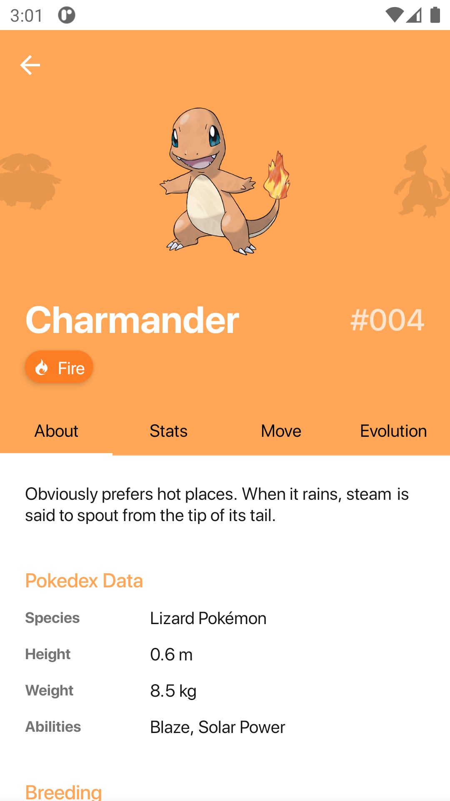
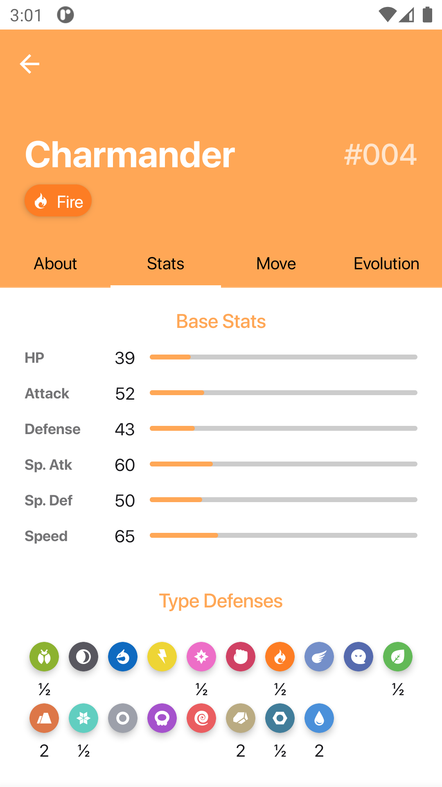
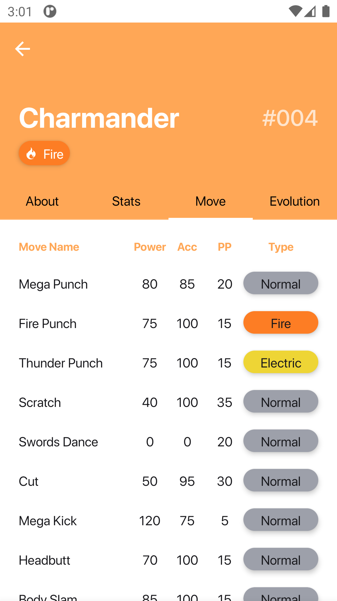
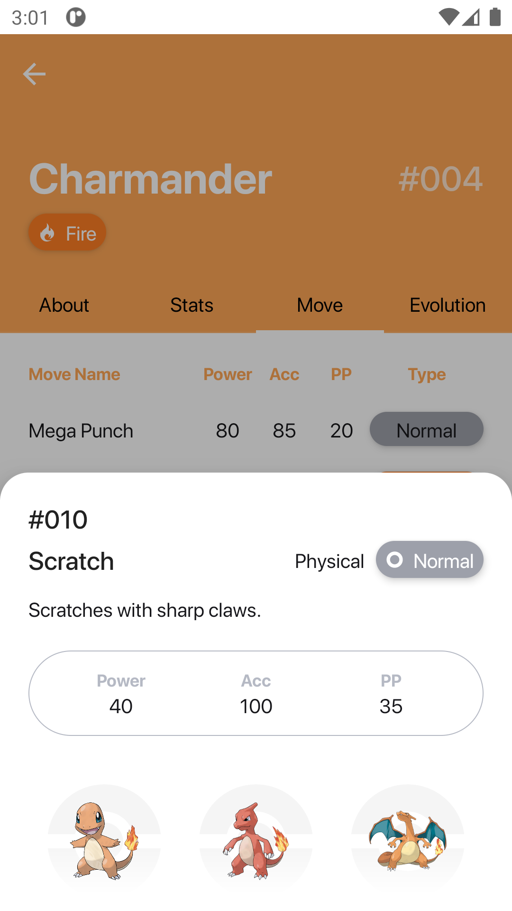
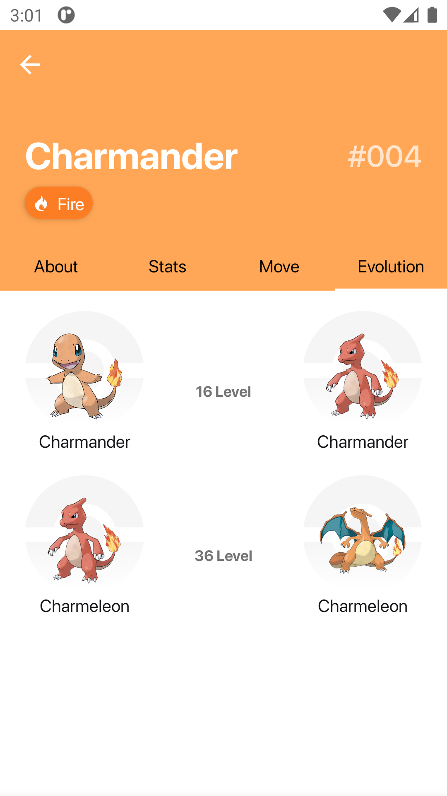
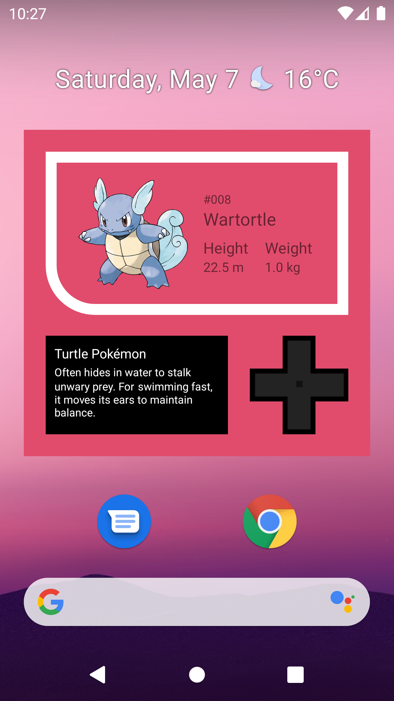

# Pokedex

This is a pokedex app made with compose.

</br>


## Architecture
Using MVVM + Clean architecture

## Libraries
* [Kotlin](https://kotlinlang.org/)
* [Coroutines](https://github.com/Kotlin/kotlinx.coroutines) + [Flow](https://kotlin.github.io/kotlinx.coroutines/kotlinx-coroutines-core/kotlinx.coroutines.flow/) for aynsc
* [Hilt](https://dagger.dev/hilt/) for dependency injection.
* [Retrofit2 & OkHttp3](https://github.com/square/retrofit) - for rest api
* [Coil](https://github.com/coil-kt/coil) - for load image
* [JetPack](https://developer.android.com/jetpack)
  - compose, lifecycle, hilt, navigation, room, paging, dataStore, palette
* [Accompanist](https://github.com/google/accompanist)
  - flowlayout, pager, placeholder, navigation-material

## Sources
[Design] The design is inspired by the [Pokédex app](https://www.behance.net/gallery/95727849/Pokdex-App?tracking_source=search_projects_recommended%7Cpokedex) created by Flavio Farias.

[API] The project is using [PokeAPI](https://pokeapi.co/)

## Screenshots

<p align="center">
  
  
  
  
  
  
  
  
  
  
</p>

# License
```xml
Copyright 2021 D000L (SeokHo Im)

Licensed under the Apache License, Version 2.0 (the "License");
you may not use this file except in compliance with the License.
You may obtain a copy of the License at

   http://www.apache.org/licenses/LICENSE-2.0

Unless required by applicable law or agreed to in writing, software
distributed under the License is distributed on an "AS IS" BASIS,
WITHOUT WARRANTIES OR CONDITIONS OF ANY KIND, either express or implied.
See the License for the specific language governing permissions and
limitations under the License.
```